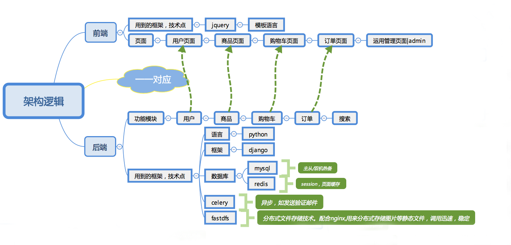

[](https://github.com/Pad0y)
[](https://github.com/Pad0y)
[](https://blog.csdn.net/qq_34356800)
[](https://www.travis-ci.org/Pad0y/Django2_dailyfresh)

---
# 天天生鲜-django2.2版本
  https://github.com/Gladysgong/Django2_dailyfresh

## 简介
**本项目替换原项目框架django1.8为最新版的django2.2.5（已修复为2.2.10）**，该项目包含了实际开发中的电商项目中大部分的功能开发和知识点实践，
是一个非常不错的django学习项目，同时也记录在替换框架中遇到的坑，所遇到的django1.x和2.x的区别，希望对各位的学习有所帮助。

关键词：django2 celery fdfs haystack whoosh redis nginx 高并发 分布式

# 技术栈

- 数据库: MySql、 redis  
    - redis：作为django缓存和session存储后端，提升网站性能，给予用户更好体验
- 任务队列(异步处理): celery(django-celery)   
    - celery：分别负责用户注册异步发送邮件以及不同用户登陆系统动态生成首页
- 分布式文件存储: FastDFS   
    - fdfs+nginx：存储网站静态文件，实现项目和资源分离，达到分布式效果
- 搜索引擎(商品检索)：  haystack(django-haystack)、whoosh、二次开发  
    - haystack+whoosh+jieba：全文检索框架，修改底层haystack库使之对中文搜索更加友好
- web服务器配置: Nginx+ uwsgi    
- 开发环境： PyCharm、Linux、vim   

## 开发环境  
```text
python:3.6.4
django:2.2.10
pycharm:2019.2
OS: Mac
```
## 技术架构

* 开发架构    
采用BS结构, 即Browser/Server(浏览器/服务器)结构,构建一个web的网站商城系统, 其架构逻辑:   



* 部署架构     
Nginx+uwsgi     

    
## 功能模块
主要分为四个大模块:    
* 用户模块
   
    - 注册登录
        - 采用Django自带的认证系统,继承了AbstractUser类，本身就包含了cookie、session操作
            - 基本方法使用authenticate()、login()、logout()、login_required() 
            - Redis实现对session的缓存，邮件采用Django内置的send_mail()函数，采用celery实现异步请求
            - 历史浏览记录使用Redis的list作为记录

* 商品相关模块
    - 采用MySQL数据库
    - haystack+whoosh实现对商品的检索
    - Nginx+fastdfs实现对图片的存储
* 购物车相关模块
    - 使用Redis对购物车商品进行记录缓存
* 订单相关模块
    - 生成订单
        - 使用MySQL事务，对一组sql操作进行提交或者撤销 使用悲观锁处理订单并发效果
    - 支付订单
        - 调用支付宝的支付接口。


- [x] 用户模块
    - [x] 注册
    - [x] 登录
    - [x] 激活(celery)
    - [x] 退出
    - [x] 个人中心
    - [x] 地址管理
- [x] 商品模块
    - [x] 首页(celery)
    - [x] 商品详情
    - [x] 商品列表
    - [x] 搜索功能(haystack+whoosh)
- [x] 购物车模块(redis)
    - [x] 增加
    - [x] 删除
    - [x] 修改
    - [x] 查询
- [x] 订单模块
    - [x] 确认订单页面
    - [x] 订单创建
    - [x] 请求支付(支付宝)
    - [x] 查询支付结果
    - [x] 评论
 
[查看各模块详情分析](docs/Analysis.md)

## 数据库表


* SPU是商品信息聚合的最小单位，是一组可复用、易检索的标准化信息的集合，该集合描述了一个产品的特性。通俗点讲，属性值、特性相同的商品就可以称为一个SPU。     
例如，iphone4就是一个SPU，N97也是一个SPU，这个与商家无关，与颜色、款式、套餐也无关。
* SKU即库存进出计量的单位， 可以是以件、盒、托盘等为单位，在服装、鞋类商品中使用最多最普遍。   
例如纺织品中一个SKU通常表示：规格、颜色、款式。 
 

## 功能模块展示

[点击查看--多图预警](docs/show.md)

## 功能与性能优化
1. 用户注册发激活邮件时，可能发送邮件所需的时间较长，客户端会需要等待，用户体验不好。     
 >  改进: 把耗时的任务放到后台异步执行，此处使用celery任务队列, 其中使用redis作中间件。  
2. redis存储用户历史浏览记录, 采用list数据结构: History_用户id: [skuid1,skuid2,skuid3]
3. 使用redis存储用户购物车商品信息，采用hash数据结构: cart_userid: {'sku_id1': num, 'sku_id2': num}    
4. 采用分布式文件系统， 把商品图片等信息存储在FastDFS系统中, Nginx+FastDFS配合, 减少服务器的压力。         
5. 页面静态化： 首页、商品列表页、商品详情页等用户共同的页面, 把页面静态化，以减少对数据库的操作。当后台数据更改时自动重新生成静态页。  
6. 页面数据缓存，把页面使用的数据存放在缓存中，当再次使用这些数据时，先从缓存中获取，如获取不到，再去查询数据库，减少数据库的查询次数。  
7. 订单并发

## 项目架构图


## 数据库表分析图


# 环境配置
- [FDFS配合Nginx的安装](docs/FastDFS-description.md)
- [python3与fdfs交互踩坑记录](docs/py3fdfs.md)
- [windows上celery4.x不兼容问题完美解决办法](docs/celery_on_win10.md)
- [jieba分词设置修改](docs/jieba.md)
- [支付宝sdk接入](https://github.com/fzlee/alipay/blob/master/README.zh-hans.md)
- [django1.x和2.x的不同之处](docs/diff.md)
# 项目部署（开发环境）
- 依赖库安装
```text
pip install -U pip
pip install -r requirements.txt
```
- mysql数据库创建
```mysql
CREATE DATABASE `dailyfresh` CHARACTER SET 'utf8';
```
- 启动项目所需服务(win10)
```shell script
# windows redis的启动，配置文件在redis安装目录下
$ redis-server redis.windows.conf

# 启动celery, 进入项目虚拟环境，在项目根目录下执行
$ celery -A celery_tasks.tasks worker --loglevel=info -P eventlet
```

# 启动FastDFS服务, 启动nginx
```shell script
$ /usr/bin/fdfs_trackerd /etc/fdfs/tracker.conf start
$ /usr/bin/fdfs_storaged /etc/fdfs/storage.conf start
$ nginx
```
# 项目配置文件修改
```text
1. 重命名Django2_dailyfresh文件夹下的settings.py.example
   文件为settings.py

2. 修改数据库配置信息
DATABASES = {
    'default': {
        'ENGINE': 'django.db.backends.mysql',
        'NAME': 'dailyfresh',
        'HOST': 'localhost',
        'PORT': '3306',
        'USER': '#',  # 数据库用户名
        'PASSWORD': '#',  # 数据库密码
    }
}

3. 修改邮箱配置信息，163邮箱配置信息自查
EMAIL_BACKEND = 'django.core.mail.backends.smtp.EmailBackend'
EMAIL_HOST = 'smtp.qq.com'
EMAIL_PORT = 25
EMAIL_HOST_USER = 'xxxx@qq.com'  # 发送邮件的邮箱
EMAIL_HOST_PASSWORD = 'xxxx'  # qq邮箱授权码
# EMAIL_USE_TLS = True  # 与SMTP服务器通信时，是否启动TLS链接(安全链接)
EMAIL_FROM = '天天生鲜<XXXXX@qq.com>'  # EMAIL_FROM 和 EMAIL_HOST_USER必须一样

4. 填写fdfs的配置信息，注意端口是nginx的端口
FDFS_STORAGE_URL = 'http://ip:port'  

5. 支付功能不需要用到的保持默认即可，需要用到移步官方文档或看配置文件注释
```
# 迁移数据库
```
python manage.py makemigrations
python manage.py migrate
```
# 启动
```
python manage.py runserver
```
# 效果图


# BUGFIX
- 2020.4.12: Fix the background management page display
- 2020.4.02: [Fixed CVE-2020-5313 FLI buffer overflow](https://github.com/advisories/GHSA-hj69-c76v-86wr)
- 2020.2.12：[Fixed CVE-2020-7471 SQL injection](https://www.djangoproject.com/weblog/2020/feb/03/security-releases/)
- 2020.1.17：[Fixed CVE-2019-19844](https://github.com/advisories/GHSA-vfq6-hq5r-27r6)
- 2019.11.6：[Fixed CVE-2019-19118](https://github.com/advisories/GHSA-hvmf-r92r-27hr)
- 2019.10.23：[Bump pillow from 6.1.0 to 6.2.0 ](https://github.com/Pad0y/Django2_dailyfresh/pull/3/commits/f2c74ed0a8d262b1da722dfdb4815348ec31992e)

# 后言
如果本项目能帮助到在学习django2的你或者对你有其他帮助，give me a star
若有什么需要改进或者疑问的地方欢迎提出issue 

# Links      
* Libfastcommon: 安装FastDFS之前要先安装它的依赖库libfastcommon    
[https://github.com/happyfish100/libfastcommon/releases](https://github.com/happyfish100/libfastcommon/releases)   
* FastDFS   
[https://github.com/happyfish100/FastDFS](https://github.com/happyfish100/FastDFS)
* Nginx    
[https://nginx.org/download/](https://nginx.org/download/)    
* fastdfs-nginx-module   
[https://github.com/happyfish100/fastdfs-nginx-module/releases](https://github.com/happyfish100/fastdfs-nginx-module/releases)   
* 支付宝api    
[https://open.alipay.com/platform/home.htm](https://open.alipay.com/platform/home.htm)    
* celery   
[http://docs.jinkan.org/docs/celery/](http://docs.jinkan.org/docs/celery/)   

